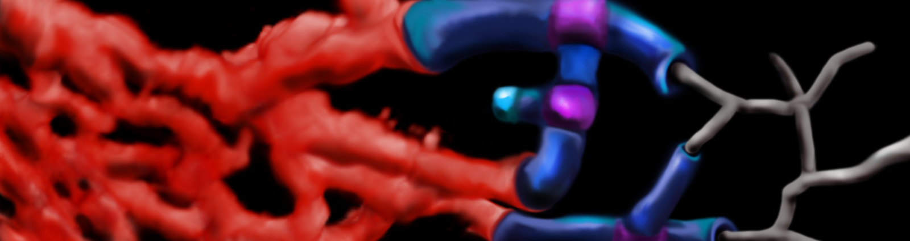

# Vessel3DTracer
  
 	
 Vessel3DTracer is an ImageJ plugin for segmentation and quantification of hollow and filled 3D vasculature.

 visit for manual and tutorials:
 https://ki.se/en/mbb/vessel3dtracer
 
  You can download the .jar file to the ImageJ Plugin folder or use the Updater:
  
 To upload, add a new update site (check 'for upload' before clicking 'Add')
or change your existing one. You need to set the URL to
    http://sites.imagej.net/Trusohamn/
the sshHost to
    webdav:Trusohamn
and set the upload directory to '.' in updater's Advanced Mode's 'Manage Update Sites'.

## Escaping_Ring

 Java8 project 

## simplePythonSimulation

2d random 'vessel recognition' visualisation: adding new Ring and Branch objects (Python3)

 
