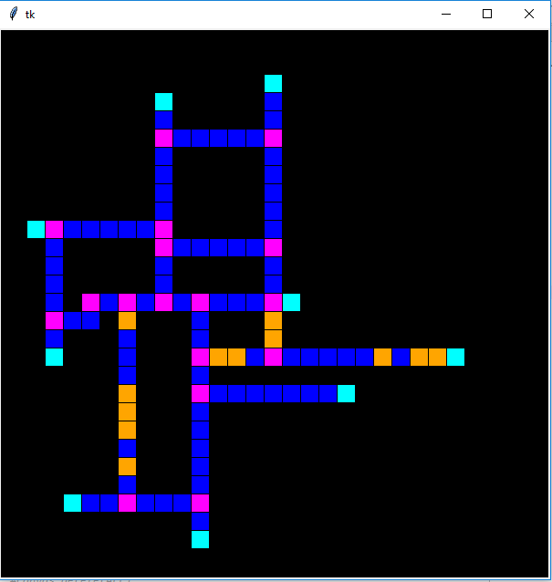

# Vessel3DTracer

 Vessel3DTracer is an ImageJ plugin for segmentation and quantification of hollow and filled 3D vasculature.

 visit for manual and tutorials:
 https://ki.se/en/mbb/vessel3dtracer

## Escaping_Ring

 Java8 project 

## simplePythonSimulation

2d random 'vessel recognition' visualisation: adding new Ring and Branch objects (Python3)

 
